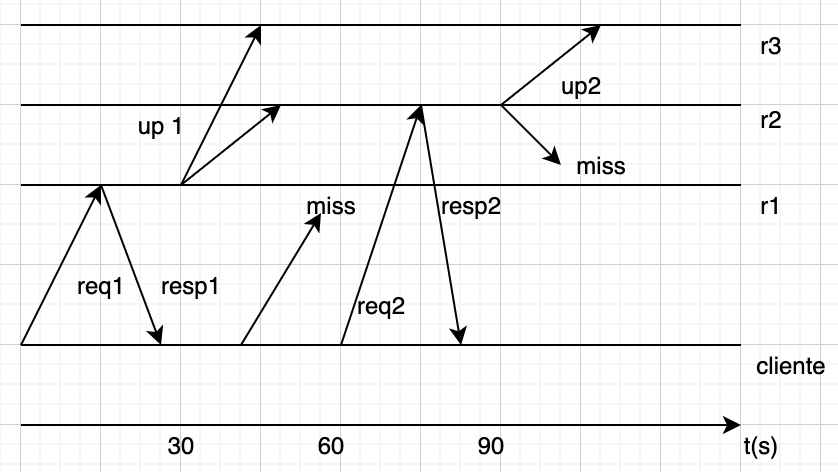

# Relatório do projeto Sauron

Sistemas Distribuídos 2019-2020, segundo semestre

## Autores
 
**Grupo A05**

*(preencher a tabela abaixo com dados da equipa; e depois apagar esta linha)*  

| Número | Nome              | Utilizador                       | Correio eletrónico                  |
| -------|-------------------|----------------------------------| ------------------------------------|
| 83462  | Francisco Seixas| <https://github.com/Seixaaas>  | <franscisco.m.seixas@tecnico.ulisboa.pt>|
| 85320  | 	Joao Pedro     | <https://github.com/Jocampe>     | <joao.nuno.pedro@tecnico.ulisboa.pt>  |
| 79690  | Tomás Zaki     | <https://github.com/Zakovich> | <tomas.zaki@tecnico.ulisboa.pt>           |

 
  

## Melhorias da primeira parte

_(que correções ou melhorias foram feitas ao código da primeira parte -- incluir link para commits no GitHub onde a alteração foi feita)_

- [Fix da função trace](https://github.com/tecnico-distsys/A05-Sauron/commit/74cc2c0d91f2f4986c9b2244ae995f106d1ac5f5)
- [Ordenação das Observações no comando trace](https://github.com/tecnico-distsys/A05-Sauron/commit/74cc2c0d91f2f4986c9b2244ae995f106d1ac5f5)
- [Adicionadas exceções](https://github.com/tecnico-distsys/A05-Sauron/commit/a68bc60ed5657eb47b741df4009044dc59a4931e)
- [Adicionadas exceções2](https://github.com/tecnico-distsys/A05-Sauron/commit/cae3cedf80e120cfd362a764e3365843121b50e1)
- [Adicionado testes de integração](https://github.com/tecnico-distsys/A05-Sauron/commit/cae3cedf80e120cfd362a764e3365843121b50e1)

## Modelo de faltas

Existem 3 tipos de faltas que um sistema distribuído pode sofrer. 
Falhas Arbitrárias ou Bizantinas, faltas Densas e faltas Silenciosas. Destas três falhas, o sistema só irá tolerar falhas silenciosas, isto é, quando uma componente falhas que provocam uma paragem e não resposta da componente que sofreu a falta.
No caso do nosso projecto isto traduz-se em dois tipos de falhas:

-Comunicação cliente-réplica

-Comunicação réplica-réplica

No primeiro caso, caso um cliente faça um pedido, poderá acontecer que a réplica que este tenta comunicar não responde ao pedido efectuado. Pode acontecer dado a uma falha no canal de comunicação ou caso a réplica falhe.
No segundo caso, caso uma réplica tente enviar uma actualização de informação a outra réplica e esta não receba a informação. Semelhante ao caso anterior, isto pode acontecer dado a uma falha dos canais de comunicação ou de falha de uma réplica.

## Solução

_(Figura da solução de tolerância a faltas)_

_(Breve explicação da solução, suportada pela figura anterior)_
Através do FrontEnd, o cliente conhece todas as réplicas activas. Sempre que é feito um pedido, este é enviado para a réplica mais "próxima". Quando a comunicação entre estes falha (seja devido a uma falha no canal de comunicação, seja por falha da réplica em si) o cliente comunica com a seguinte réplica mais próxima.

Por outro lado, se a comunicação entre réplicas falha, a réplica que está a fazer o update, não deverá tentar actualizar a réplica que falhou. 

## Protocolo de replicação

O protocolo de replicação escolhido é um semelhante ao Gossip. O Gossip é um protocolo de replicação fracamente coerente, ou seja, a troco de menor coerência, é oferecido alta disponibilidade aos clientes. 
No Gossip, a actualização das réplicas é feito, periodicamente, em background, ou seja, a informação é actualizada entre réplicas discretamente. 
É mantido um timestamp vectorial, um vector de inteiros que reflete a última versão que o cliente acedeu.
De notar que os clientes têm sempre a garantia que se o cliente lê um valor mais recente de uma réplica, não vai ler um valor mais antigo de outra réplica.
Neste protocolo também há o respeito da ordem causal entre modificações, isto é, se uma modificação m2 depender de uma m1, a réplica não executa m2 sem antes ter executado m1.
Sempre que é feito um pedido pela parte do cliente, este envia o pedido juntamente com o timestamp e a réplica responde a esse pedido juntamente com um timestamp vectorial actualizado.

No caso do projecto, os FE representam os clientes eye e spotter, juntamente com o Silo-Frontend. Sempre que estes executam uma operação, são usadas as funções de request do Frontend que por sua vez, envia o pedido para uma réplica do Silo-Server. As réplicas recebem o pedido e enviam uma resposta juntamente com a actualização do timestamp.
Para fins de optimização de gestão de nomes e de sincronização deste sistema distribuído, foi usado o Apache Zookeeper.

## Opções de implementação

- Definimos que o número de réplicas será 4. O cliente não conhece este valor inicialmente, por isso usamos o listRecords para encontrar este número.
- Assumimos que o zookeeper nunca falha.
- Quando um cliente é inicializado, ele liga-se a uma réplica. Se não a conseguir contactar por alguma razão, falha.
- Criamos um “vetor timestamp” que é enviado e recebido pelos clientes ao fazer uma consulta ou update para assegurar que os estes, recebam um valor (no caso da leitura) ou guardem um valor (no caso do update) atual.
- Nas réplicas, guardamos também um “vetor timestamp”, que vai ter, tal como no cliente, a versão mais atualizada de cada uma das outras réplicas registadas no zookeeper. Em cada pedido de leitura do cliente, estes dois vetores são comparados para garantir que o cliente vai receber o valor mais atualizado.
- Para fazer o gossip entre réplicas, usamos uma estrutura de dados, updateLog, e mais um “vetor timestamp”. Periodicamente estes são enviados e recebidos pelas réplicas vizinhas, propagando assim os updates que cada réplica tinha recebido individualmente de um cliente. Posteriormente, as réplicas executam os updates recebidos umas das outras e o updateLog é apagado, ficando a réplica num estado atualizado.
- Não chegamos a implementar leituras coerentes por cliente. Neste caso a solução passava por ter uma cache do cliente.

## Notas finais

Relativamente à tolerância de faltas, a implementação de caches poderia ajudar a atenuar esse problema. Uma de duas linhas seria possível:

-Caches de pedido-resposta

-Caches como réplica parcial
